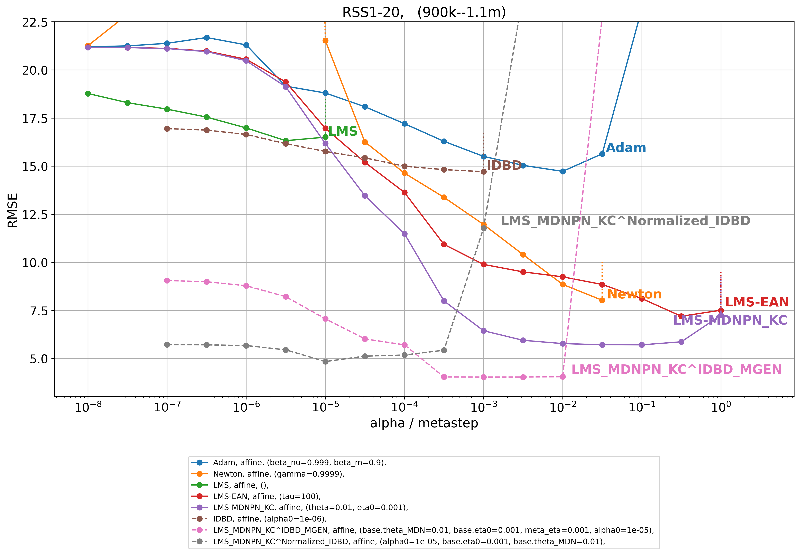
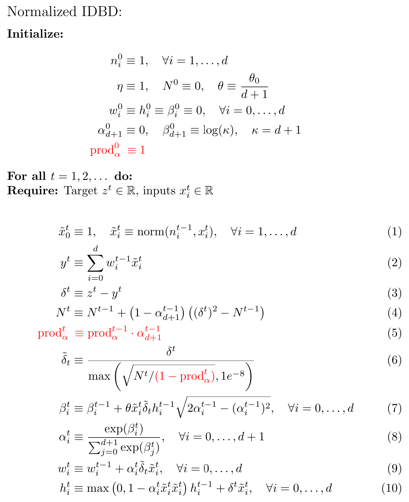

Here's a well-formatted and clear README file based on your instructions, ready for your GitHub repository:

---

# SALT Project Algorithms

This repository contains implementations of various algorithms for the [**SALT project**](https://docs.google.com/document/d/1KZBKbQktjUjvgLIRfyn2fzGtWp81Eqwl2963F2MLE7Y/edit?tab=t.0).

The SALT challenge involves building the best possible **Streaming Affine Learning Tracker**. It is part of addressing [Step 1 of the Alberta Plan for AI Research](https://arxiv.org/abs/2208.11173).

---

## Repository Setup

To set up this repository, please download the datasets from [this Google Doc](https://drive.google.com/drive/folders/1-d8JJlxin4qWpQrAzXgs17ndkR8Gil_m) to your local `data` directory:

```bash
gdown --folder https://drive.google.com/drive/folders/1-d8JJlxin4qWpQrAzXgs17ndkR8Gil_m
```

---

## How to Use

You can run individual algorithms directly from the `algorithms` directory. For example:

```bash
python3 algorithms/LMS.py
```

Alternatively, perform parameter sweeps:

* For Base algorithms (LMS, LMS\_MDN, ...):

```bash
python3 _sweep_alpha.py
```

* For Meta algorithms (IDBD, ...):

```bash
python3 _plot_from_CSV_across_datasets.py
```

**Output:**
Each run generates a `.csv` file stored in the `csv` directory. If a CSV already exists, new results are appended. The CSV format matches [this spreadsheet](https://docs.google.com/spreadsheets/d/155wYlRmVx0_XWc1zFJ_27yvlj-ahH2hPaErBdlGTWIc/edit?gid=907851754#gid=907851754), so data can easily be copied and pasted into it.

---

## Plotting Results

To visualize the results from CSV files:

* RMSE vs stepsize/meta-stepsize for multiple algorithms:

```bash
python3 _plot_from_CSV.py
```

* RMSE sensitivity across datasets for a single algorithm:

```bash
python3 _plot_from_CSV_across_datasets.py
```

The plots will be saved to the plots directory.

Example plot generated by `_plot_from_CSV.py`:



---

## Implemented Algorithms (click to expand)

<details>
<summary>Normalized IDBD</summary>

### Algorithm Pseudocode 


</details>

